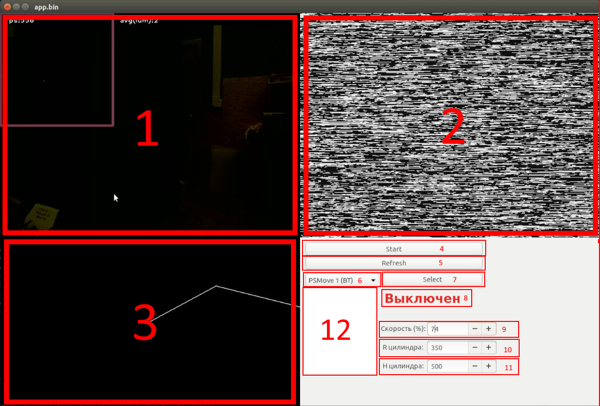

# Код для ПК (в случае с тестами - L4T Ubuntu) (RobotArm)

Прога, написанная на коленке, хотя бы работающая :grinning:

1. [Установка](#установка)
2. [Использование](#использование)

## Установка
Установка идёт в несколько шагов:
### 1. Установка CMake, git, python3, g++ и другой фигни.
CMake: откройте терминал и введите команды:
```sh
sudo apt install libssl-dev
mkdir ~/cmake && cd ~/cmake
git clone --recursive https://github.com/kitware/cmake.git
cd cmake
./configure
make -j$(nproc)
sudo make install
```
Откройте терминал и введите:
```sh
sudo apt install git g++-8 python3 build-essential cmake git pkg-config libgtk-3-dev libavcodec-dev libavformat-dev libswscale-dev libv4l-dev libxvidcore-dev libx264-dev libjpeg-dev libpng-dev libtiff-dev gfortran openexr libatlas-base-dev python3-dev python3-numpy libtbb2 libtbb-dev libdc1394-22-dev libudev-dev libbluetooth-dev libusb-dev libhidapi-dev libglm-dev libepoxy-dev portaudio19-dev
```
### 2. Установка OpenCV 3.
Откройте терминал и поочерёдно введите команды:
```sh
mkdir ~/opencv3 && cd ~/opencv3
git clone https://github.com/opencv/opencv.git
cd opencv
git checkout 3.3.1
cd  ..
git clone https://github.com/opencv/opencv_contrib.git
cd opencv_contrib
git checkout 3.3.1
cd ..
cd opencv
mkdir build && cd build
cmake -DCMAKE_C_COMPILER="/usr/bin/gcc-8" \
      -DCMAKE_CXX_COMPILER="/usr/bin/g++-8" \
      -D CMAKE_BUILD_TYPE=RELEASE \
      -D CMAKE_INSTALL_PREFIX=/usr/local \
      -D WITH_V4L=ON \
      -D WITH_LIBV4L=ON \
      -D OPENCV_EXTRA_MODULES_PATH=../../opencv_contrib/modules \
      -WITH_GTK=ON \
      -WITH_QT=OFF ..
make -j$(nproc)
sudo make install
```
### 3. Установка PSMoveAPI.
Откройте терминал и поочерёдно введите команды:
```sh
mkdir ~/psmoveapi && cd ~/psmoveapi
git clone --recursive https://github.com/thp/psmoveapi.git
cd psmoveapi
bash scripts/install_dependencies.sh
mkdir build && cd build
cmake -DCMAKE_C_COMPILER="/usr/bin/gcc-8" \
      -DCMAKE_CXX_COMPILER="/usr/bin/g++-8" \
      -DPSMOVE_USE_PSEYE=ON ..
make -j$(nproc)
sudo make install
```
### 4. Установка этой проги.
Откройте терминал и поочерёдно введите команды:
```
cd
pip3 install SpeechRecognition fuzzywuzzy pyaudio
git clone https://github.com/dex22044/RobotArm
cd RobotArm/PC/RobotClient-Final
make
bash doShit.sh
```
## Использование

Части интерфейса проги:
1. Картинка с локальной камеры
2. Картинка с камеры роборуки
3. Симуляция роборуки
4. Кнопка "Start", которая вообще ничего не делает<sup>3</sup>
5. Кнопка обновления списка контроллеров
6. Список контроллеров, которые синхронизированы с системой
7. Аналог кнопки "Start", при нажатии которой выполняется подключение к контроллеру
8. Текст, в котором отображается текущий статус программы/роборуки
9. Скорость в прцентах, которую можно изменять
10. Радиус цилиндра ограничения рабочей области манипулятора<sup>1</sup>
11. Высота этого цилиндра<sup>1</sup>
12. Список записанных точек и траекторий<sup>2</sup>

Примечание 1: так как про тип ограничения рабочей области было не так-то много, и не был задан тип ограничения, мы сделали ограничение по цилиндру.

Примечание 2: да, точки и траектории хранятся в одном списке.

Примечание 3: не задавайте лишних вопросов. Так надо.
